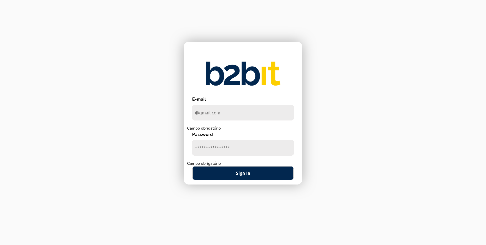
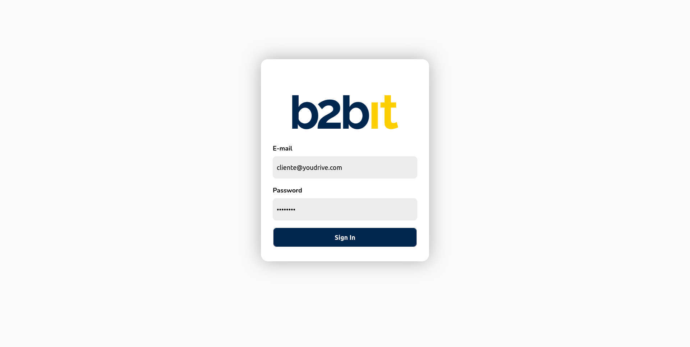
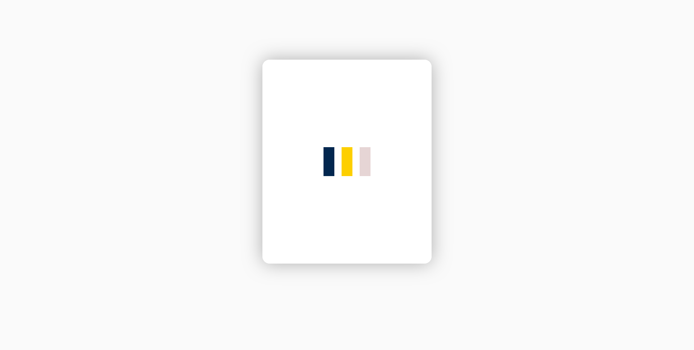
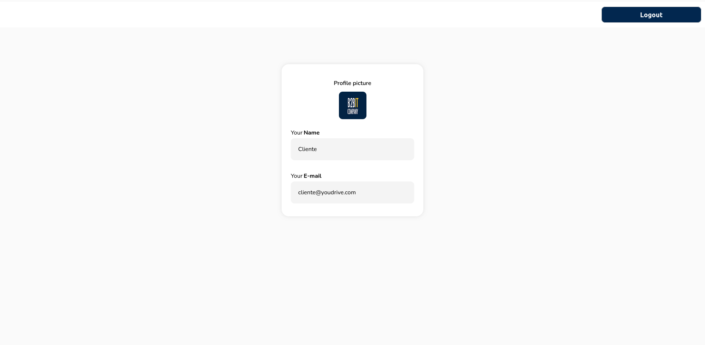

# Frontend by b2bit

[Descrição do projeto](https://doc.clickup.com/3020915/p/h/2w63k-48543/4fbf8b7f844323d)

## Deploy
Você pode acessar a aplicação online em vez de rodar no "localhost":
    [Acesse o APP aqui](https://b2bitlogin.netlify.app/)

## Testando a Aplicação de Login

    > Iniciar a Aplicação:
        Certifique-se de ter o servidor de desenvolvimento da aplicação em execução localmente. Se estiver usando o Create React App, você pode iniciar o servidor de desenvolvimento com o comando npm start.

    > Acessar a Página de Login:
        Abra o navegador da web e acesse a página inicial da aplicação. Geralmente, isso será http://localhost:3000 se estiver usando o Create React App.
        Você deve ser redirecionado para a página de login automaticamente, ou pode navegar para a página de login manualmente, dependendo da configuração da aplicação.

    > Preencher os Campos de Login:
        Na página de login, preencha os campos de email e senha com os dados fornecidos no JSON de teste.
            As credenciais estão disponíveis na descrição do projeto:

[Acesse a descrição do projeto](https://doc.clickup.com/3020915/p/h/2w63k-48543/4fbf8b7f844323d)

        Certifique-se de inserir os dados corretamente, pois eles serão usados para autenticar o usuário na API.

    > Clicar no Botão de Login:
        Depois de inserir os dados de login corretamente, clique no botão "Sign in" ou "Login" para enviar a requisição para a API.

    > Verificar a Resposta da API:
        Se a requisição for bem-sucedida e a autenticação for válida, você deverá ser redirecionado para a página de perfil ou receber uma mensagem de sucesso.
        Se a autenticação falhar (por exemplo, devido a dados de login incorretos), você deverá ver a mensagem "Usuário ou senha inválidos" ou uma mensagem de erro similar.

    > Verificar os Dados no LocalStorage:
        Após um login bem-sucedido, verifique se o token de acesso está sendo armazenado corretamente no LocalStorage do navegador.
        Use as ferramentas de desenvolvedor do navegador para inspecionar o LocalStorage e verifique se o token está presente.

    > Explorar a Página de Perfil:
        Se o login for bem-sucedido e os dados estiverem corretos no LocalStorage, você pode explorar a página de perfil.
        Certifique-se de que os dados do perfil do usuário estão sendo exibidos corretamente na página de perfil.

    > Testar o Logout:
        Na página de perfil, clique no botão "Logout" para fazer logout da conta.
        Verifique se o token de acesso foi removido do LocalStorage e se você foi redirecionado de volta para a página de login.

    > Testar os Casos de Erro:
        Para testar casos de erro, tente fazer login com dados de login incorretos e verifique se recebe a mensagem de erro apropriada.
        Verifique se a aplicação lida corretamente com erros de rede ou outros problemas que possam surgir durante o processo de login.

## Telas da Aplicação

### Login:

### Campos Obrigatórios:

### Campos Preenchidos:

### Tela de Carregamento:

### Perfil:
